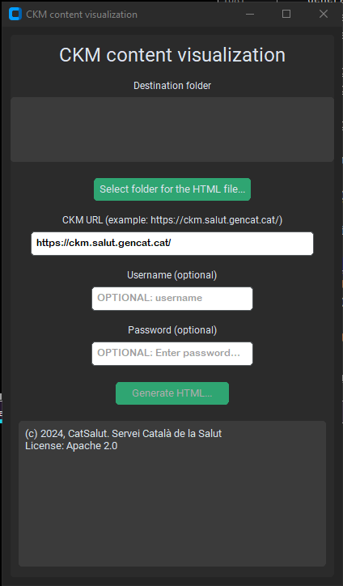
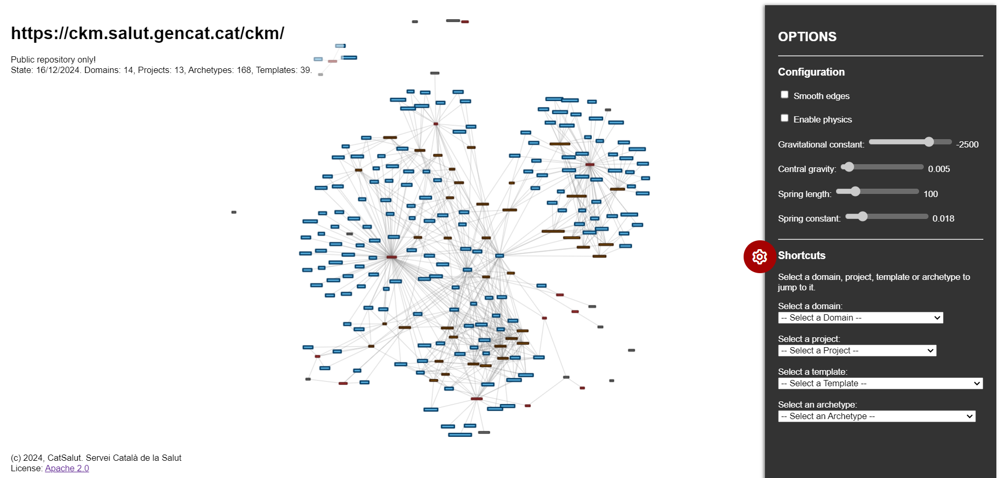

# CKM content visualization
Script: CKM_List_all_resources_universal_v0_8

## Short description

With a given CKM URL, this tool downloads information about domains, projects, templates and archetypes in the CKM, using the CKM Rest API. 

Once done with the download, the tool creates a HTML file with a navigable network of the interconnected resources.

## How to use this
### Download information from the CKM
When the script is executed, a GUI is presented to the user.

  

First, the user has to select the folder where the resulting HTML file should be saved. 
 
For this, press the "Select folder for the HTML file..." button.

Once the folder is selected, the user has to insert the CKM URL.

Examples for the CKM URL:
- https://ckm.openehr.org/
- https://arketyper.no/
- https://ckm.salut.gencat.cat/
- https://ckm.highmed.org/

As an option, a user name and password of an existing CKM account can be added. If there is no user specified, only public resources are going to be downloaded. If there is a user specified with access to private incubators, private resources are going to be included, too. 

The HTML file can be generated by clicking on the "Generate HTML..." button.

After finishing, the resulting HTML file is opened automatically.

### Explore the CKM content in the HTML page

The resulting HTML file shows a representation of the network of subdomains (dark grey), projects (red), archetypes (blue) and templates (orange). The network is created by the use of [vis.js](https://visjs.org/).

### Navigating the HTML file
For navigating the HTML file you should know the following mouse functions:

|Interaction |Effect|
|---|---|
|Mousewheel|Zoom in and out.|
|Left click hold and drag on the background|Move the network around.|
|Hover over node|Tooltip is shown with information of the node|
|Left click on node|The node and all directly connected nodes are selected. All other nodes become grey.|
|Left click on background|Deselects all selected nodes. Restores initial coloring of the nodes.|
|Right click on background|The browsers tooltip is shown. Most notably you can save the current view as an image.|

### Options menu

You can open the **options menu** by clicking on the icon in the middle of the right hand side of the screen.

#### Configuration

The menu permits to adjust the following paramenters:

|Option |Effect|
|---|---|
|Smooth edges|When enabled, the connectors between nodes become spline curves. This looks better, but slows big networks down.|
|Enable physics|When enabled, the physics is moving the nodes around to achieve the best distribution depending on the connections of every node. Turn this off when you have a good distribution and want to zoom in.|
|Gravitational constant|Defines how much "avoidance" there is between nodes. The lower the value, the more the nodes separate.|
|Central gravity|The attractive force on the nodes towards the center. The nodes get closer to center by increasing this value.|
|Spring length|Default length of the connectors between nodes. Depending on the spring constant, the connectors can be stretched.|
|Spring constant|This value determines how easy it is to stretch the connectors. The bigger the number, the more difficult it becomes.|

#### Shortcuts

In the shortcuts section of the options you can select a domain, project, template or archetype to "jump" directly to the selected resource. 

## Examples

Examples for resulting HTML files can be found in the [output_examples](./output_examples) folder.

## Source files & Compiled program
You can find a compiled version of the script in the [dist](./dist) folder.

The Python source files can be found in the [source](./source) folder.

## Publisher & License

This work is published by ["CatSalut. Servei Català de la Salut"](https://catsalut.gencat.cat/ca/inici/).

Author: [Martin A. Koch, PhD](https://www.linkedin.com/in/martin-andreas-koch-phd-49669537/)

License: [Apache License 2.0](https://www.apache.org/licenses/LICENSE-2.0)